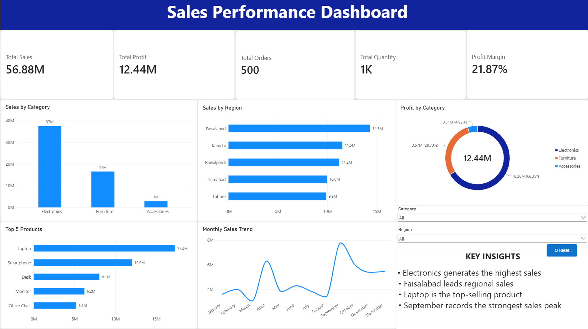

# Sales Performance Dashboard | Power BI

## 📊 Project Overview

An interactive Sales Performance Dashboard built using Microsoft Power BI to analyze e-commerce sales performance across products, categories, regions, and time.

The dashboard transforms 500 sales transactions into an interactive business intelligence report with KPIs, DAX measures, slicers, and visual analysis.

## 🎯 Key Features

- Total Sales KPI
- Total Profit KPI
- Total Orders KPI
- Total Quantity KPI
- Profit Margin KPI
- Sales by Category
- Sales by Region
- Top 5 Products
- Monthly Sales Trend
- Profit by Category
- Interactive Region and Category filters
- Reset Filters button

## 🧮 DAX Measures

- Total Sales
- Total Profit
- Total Orders
- Total Quantity
- Profit Margin

## 💡 Key Insights

- Electronics generates the highest sales.
- Faisalabad leads regional sales.
- Laptop is the top-selling product.
- September records the strongest sales peak.
- Overall profit margin is approximately 21.87%.

## 🛠️ Tools & Skills

- Microsoft Power BI
- DAX
- Microsoft Excel
- Data Visualization
- Business Intelligence
- KPI Analysis
- Data Analysis

## 📁 Dataset

The project uses a sample e-commerce sales dataset containing 500 transactions from 2025.

## 📷 Dashboard Preview

